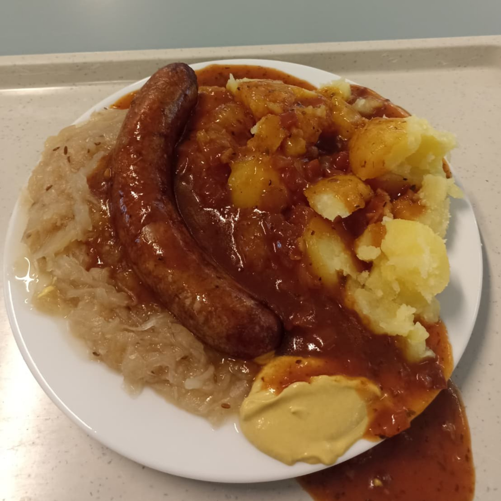

# 🌭 Bratwurst Frühwarnsystem / Mensa Hack

Ein automatisiertes System zur täglichen Überwachung von Mensen-Speiseplänen in Berlin mit speziellem Fokus auf Bratwurst-Verfügbarkeit! 

Speiseplan nur **diese und nächste Woche?**

not here!

**31-Tage Vorschau** für Hardenberg, HU Nord und Süd :D

